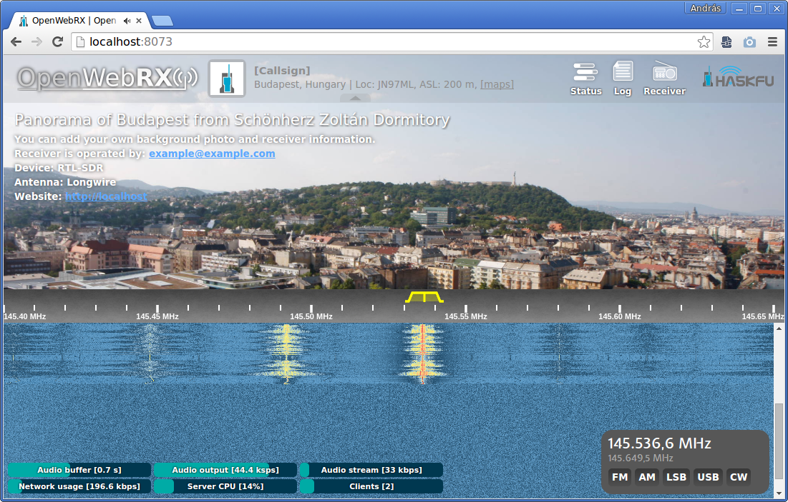
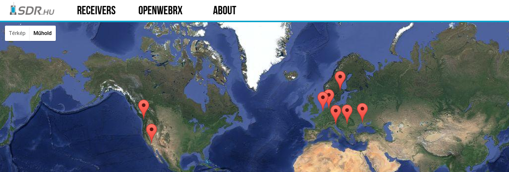
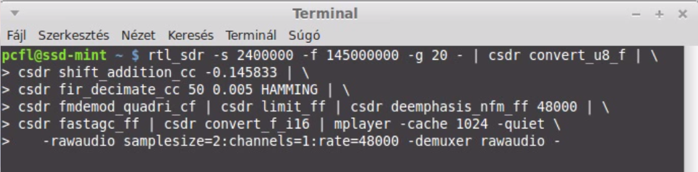
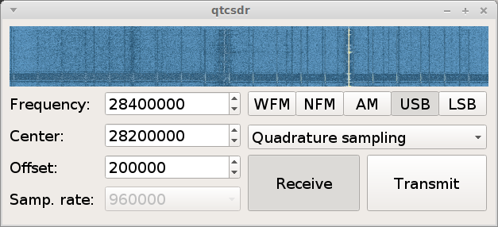
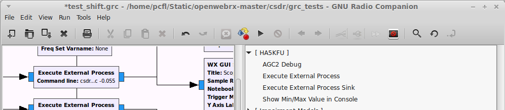
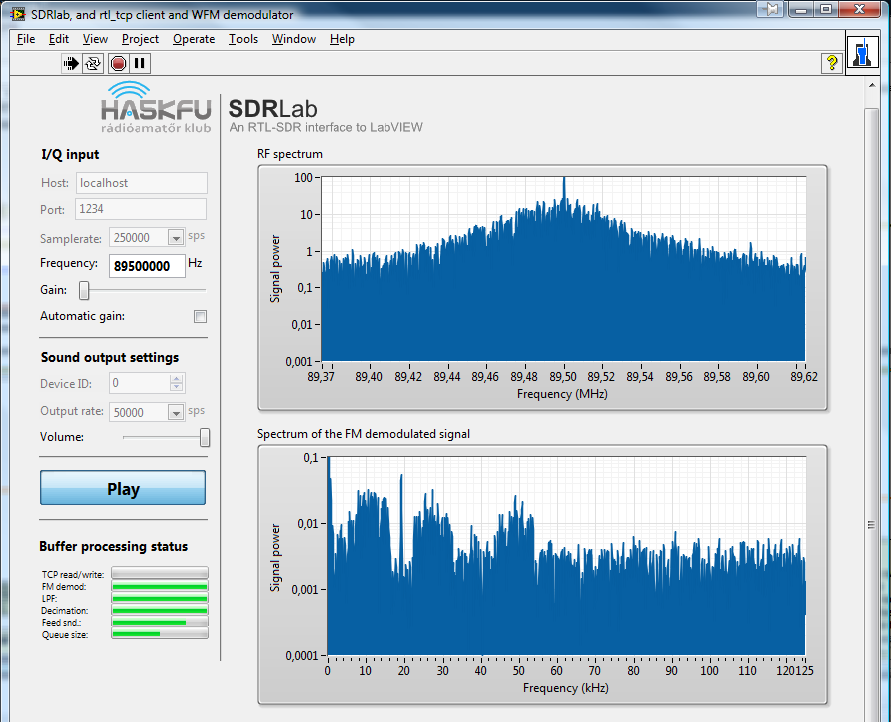

# My open source projects

## OpenWebRX

OpenWebRX is a multi-user SDR receiver software with a web interface. [https://github.com/simonyiszk/openwebrx](https://github.com/simonyiszk/openwebrx)

I also maintain the [sdr.hu](http://sdr.hu/) site, which lists publicly available receivers around the world.

## csdr

*csdr* is a simple DSP library and command-line tool for Software Defined Radio. [https://github.com/simonyiszk/csdr](https://github.com/simonyiszk/csdr)

## minidemod

*minidemod* is a really-really simple demodulator intended to teach Software Defined Radio and DSP to newcomers: [https://github.com/simonyiszk/minidemod](https://github.com/simonyiszk/minidemod)

More about it in my talk at DCC 2015:

<iframe width="100%" height="700px" src="https://youtube.com/embed/-V0rp7x454g?start=820" frameborder="0" allowfullscreen></iframe>
 

## qtcsdr

*qtcsdr* makes a ham transceiver out of your Raspberry Pi 2 and RTL-SDR, with the help of [rpitx](https://github.com/F5OEO/rpitx/)!

## gr-ha5kfu

*gr-ha5kfu* is a set of GNU Radio blocks I wrote. It has some blocks that allow you to insert external processes into a GNU Radio flowgraph: 
[https://github.com/simonyiszk/gr-ha5kfu](https://github.com/simonyiszk/gr-ha5kfu)

## SDRLab

*SDRLab* is an RTL-SDR interface to LabVIEW for educational purposes. 
[https://github.com/ha7ilm/sdrlab](https://github.com/ha7ilm/sdrlab)

## rtl_mus

*RTL Multi-User Server* is a small python script to allow multiple clients control the same RTL-SDR compatible DVB-T tuner, while also receiving I/Q samples:  
<a href="https://github.com/simonyiszk/rtl_mus">https://github.com/simonyiszk/rtl_mus</a>

